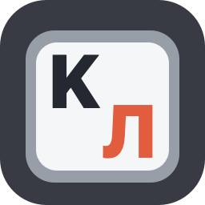
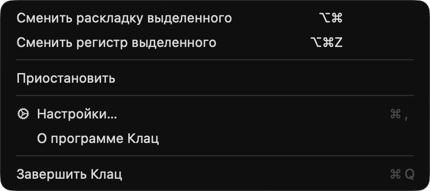
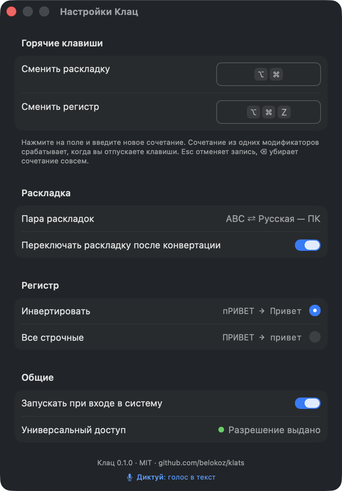

<p align="center"></p>
<h1 align="center">Клац (Klats)</h1>
<p align="center">Select text, release ⌥⌘, the keyboard layout is fixed.<br>A free macOS utility with one job. No autocorrect, no dictionaries, no network.</p>
<p align="center"><a href="README.md">Русский</a> · <a href="https://github.com/belokoz/klats/releases/latest">Download</a> · <a href="docs/HISTORY.md">How it was made</a></p>

## What it does

- **⌥⌘** retypes the selected text in the other keyboard layout: `ghbdtn` becomes `привет`, `руддщ` becomes `hello`. It picks the direction itself and switches the system layout afterwards, so you keep typing in the right one.
- **⌥⌘Z** changes the case of the selection: `пРИВЕТ` becomes `Привет`. An all-lowercase mode is in Settings.
- Nothing else. No automatic switching while you type, no autocorrect, no dictionaries, no statistics, no sounds, no background updates. The app contains no networking code at all.

Hotkeys are configurable, including modifier-only combinations. Klats works with any pair of layouts, not just Russian and English: the mapping tables are built from the real system layouts instead of being hard-coded.

<p align="center"></p>
<p align="center"></p>

## Install

1. Download `Klats-0.1.0.dmg` from [Releases](https://github.com/belokoz/klats/releases/latest), open it and drag Клац to Applications.
2. On first launch macOS says it cannot verify the developer: there is no paid Apple account behind the project. Open System Settings → Privacy & Security, scroll down and click **Open Anyway**. Once.
3. Klats asks for the Accessibility permission. It needs it to copy the selected text and paste the fixed one back. Enable Klats in the list, return to the welcome window and try it on the sample field.

Updates do not reset the permission: the app is signed with a permanent certificate.

Requirements: macOS 13 Ventura or newer, Apple Silicon or Intel. The interface is in Russian and English.

### Build from source

No Xcode needed, the Command Line Tools are enough (`xcode-select --install`).

```bash
git clone https://github.com/belokoz/klats.git && cd klats
./scripts/install.sh        # build and put into /Applications
./scripts/test.sh           # core tests
```

## How it works

One press. Klats catches the release of ⌥⌘, takes the selection with ⌘C, converts it, pastes it back with ⌘V, restores the clipboard and switches the system layout. That is why it works everywhere ⌘C and ⌘V work, and not in terminals.

The character-to-key tables are built from the system's layouts with `UCKeyTranslate` in a fraction of a millisecond: character, the key it lives on in the source layout, the character on that key in the target layout. The direction comes from the text: characters that exist in only one of the two layouts vote.

Details live in the [concept](docs/CONCEPT.md) and [design](docs/DESIGN.md) documents (Russian). The log at `~/Library/Logs/Klats/klats.log` never contains text: only the app, timing, lengths and outcome.

## Limitations

- ⌥⌘ fires when you release both keys without pressing anything else. So if you hold ⌥⌘, press nothing and let go, the selection gets converted. Plain ⌘Z undoes it.
- Terminals, remote desktops and games are not supported. In password fields Klats does nothing.
- Plain text is pasted; formatting comes from the surroundings.
- Input methods (Japanese, Chinese, Korean) are not part of a pair.

## Plans

- 1.1: clipboard history, like Win+V on Windows, on ⌃V.
- A Windows version.

## How it was made

Klats was written in three days in a dialogue with Claude Code. The author set the tasks, reviewed the artifacts and corrected course; Claude wrote the code and the documents. Concept, design, tested core, app, release, each stage reviewed. The story with dates, forks and numbers: [docs/HISTORY.md](docs/HISTORY.md) (Russian).

## From the author

🎙 [Диктуй](https://diktuy.ru/?utm_source=klats&utm_medium=github&utm_campaign=readme): voice to text.

## License

[MIT](LICENSE).
