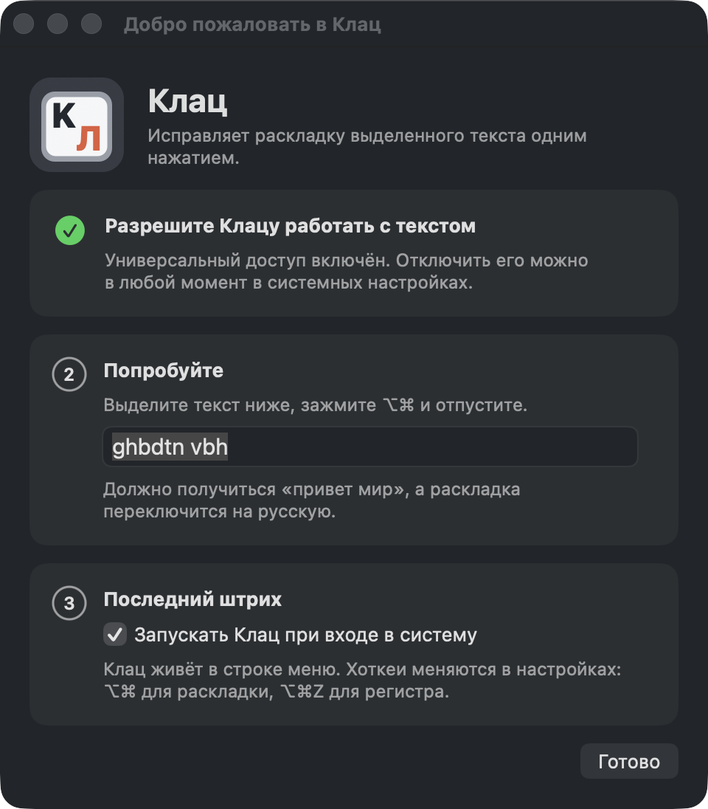

<p align="center"></p>
<h1 align="center">Клац</h1>
<p align="center">Выделил текст, отпустил ⌥⌘, раскладка сменилась.<br>Бесплатная утилита для macOS с одной функцией. Без автозамен, без словарей, без сети.</p>
<p align="center"><a href="README.en.md">English</a> · <a href="https://github.com/belokoz/klats/releases/latest">Скачать</a> · <a href="docs/HISTORY.md">Как это делалось</a></p>

## Что умеет

- **⌥⌘** переводит выделенный текст в другую раскладку: `ghbdtn` становится `привет`, `руддщ` становится `hello`. Направление определяет сам, после конвертации переключает раскладку системы, чтобы дальше печатать в ней.
- **⌥⌘Z** меняет регистр выделенного: `пРИВЕТ` становится `Привет`. Второй режим, всё строчными, включается в настройках.
- Больше ничего. Нет автопереключения по мере набора, автозамен, словарей, статистики, звуков и обновлений в фоне. Сетевого кода в приложении нет вообще.

Хоткеи меняются в настройках, в том числе на сочетание из одних модификаторов. Клац работает с любой парой раскладок, не только русской и английской: таблицы соответствия он строит из настоящих раскладок системы, а не хранит в коде.

<p align="center"></p>
<p align="center"></p>

## Установка

1. Скачайте `Клац-0.1.0.dmg` со страницы [релизов](https://github.com/belokoz/klats/releases/latest), откройте образ и перетащите Клац в «Программы».
2. При первом запуске macOS скажет, что не может проверить разработчика: у проекта нет платного аккаунта Apple. Откройте Системные настройки → Конфиденциальность и безопасность, прокрутите вниз и нажмите «Открыть всё равно». Это нужно один раз.
3. Клац попросит разрешение «Универсальный доступ». Оно нужно, чтобы скопировать выделенный текст и вставить исправленный. Включите Клац в списке, вернитесь в окно первого запуска и попробуйте на тестовом поле.

Обновления это разрешение не сбрасывают: приложение подписано постоянным сертификатом.

<p align="center"></p>

Требования: macOS 13 Ventura и новее, Apple Silicon или Intel.

### Собрать самому

Xcode не нужен, достаточно Command Line Tools (`xcode-select --install`).

```bash
git clone https://github.com/belokoz/klats.git && cd klats
./scripts/install.sh        # собрать и положить в /Applications
./scripts/test.sh           # тесты ядра
```

## Как это работает

Одно нажатие. Клац ловит отпускание ⌥⌘, через ⌘C забирает выделенное, конвертирует, через ⌘V вставляет обратно, возвращает буфер обмена в прежнее состояние и переключает системную раскладку. Поэтому он работает везде, где работают ⌘C и ⌘V, и не работает в терминалах.

Таблицы «символ ⇄ клавиша» строятся из раскладок системы через `UCKeyTranslate` за доли миллисекунды: символ, клавиша, на которой он живёт в исходной раскладке, символ на той же клавише в целевой. Направление определяется по тексту: считаются символы, которые есть только в одной из двух раскладок.

Подробности в [концепции](docs/CONCEPT.md) и [дизайне](docs/DESIGN.md). Журнал работы лежит в `~/Library/Logs/Klats/klats.log`, и текста в нём нет никогда: только приложение, время, длины и исход.

## Ограничения

- ⌥⌘ срабатывает при отпускании. Начали ⌥⌘Esc, передумали, отпустили: выделенный текст сконвертируется. ⌘Z вернёт, хоткей меняется в настройках.
- Терминалы, удалённые рабочие столы и игры не поддерживаются. В полях паролей Клац ничего не делает.
- Вставляется простой текст, форматирование берётся у окружения.
- Методы ввода (японский, китайский, корейский) в пары не входят.

## Планы

- 1.1: история буфера обмена, как Win+V в Windows, по ⌃V.
- Версия для Windows.

## Как это делалось

Клац написан за три дня в диалоге с Claude Code. Автор ставил задачи, смотрел артефакты и правил, код и документы писал Claude. Концепция, дизайн, ядро с тестами, приложение, публикация, каждый этап проходил ревью. История с датами, развилками и цифрами: [docs/HISTORY.md](docs/HISTORY.md).

## От автора

🎙 [Диктуй](https://diktuy.ru/?utm_source=klats&utm_medium=github&utm_campaign=readme): голос в текст.

## Лицензия

[MIT](LICENSE).
