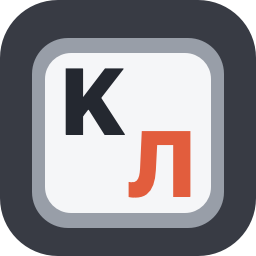
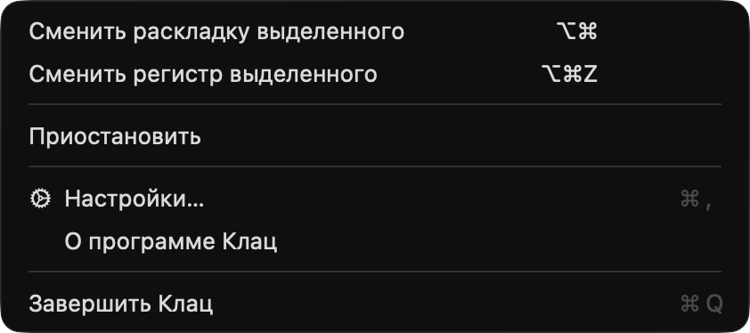
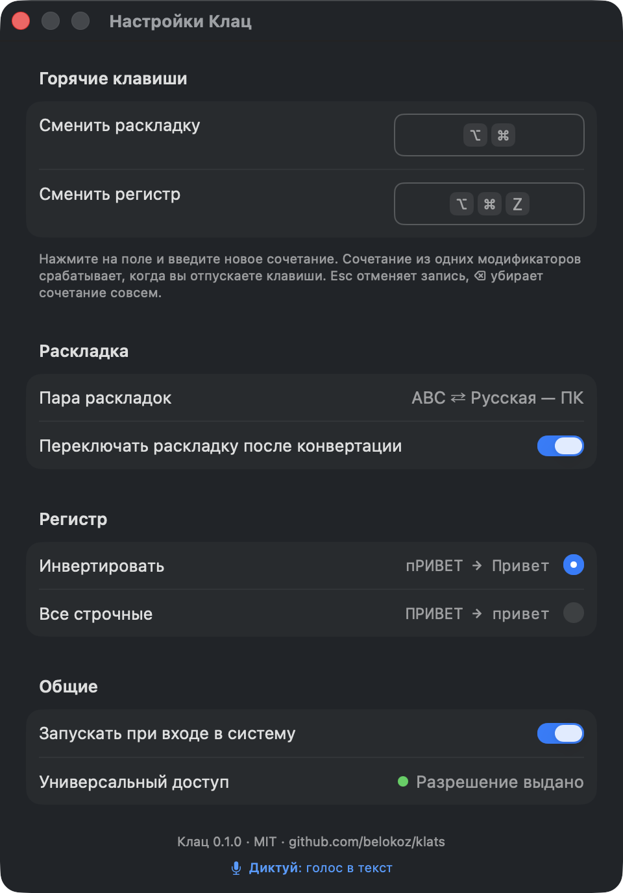
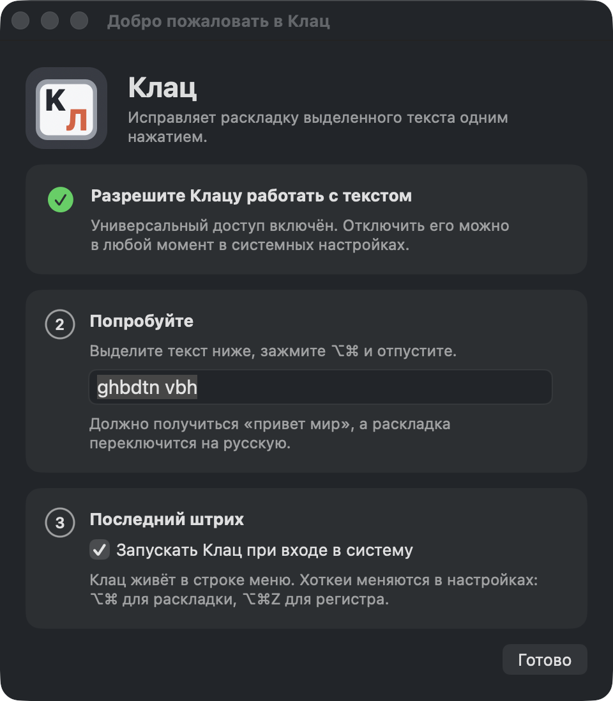
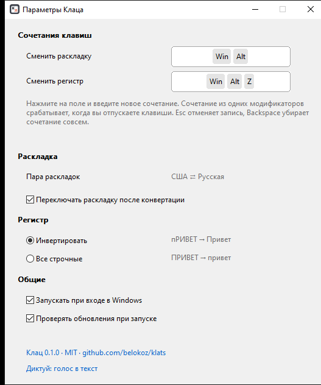

<p align="center"></p>
<h1 align="center">Клац</h1>
<p align="center">Выделил текст, нажал ⌥⌘ на Mac или Win+Alt на Windows, раскладка сменилась.<br>Бесплатная утилита для macOS и Windows с одной функцией. Без автозамен и словарей, ваш текст Клац никуда не отправляет.</p>
<p align="center"><a href="https://github.com/belokoz/klats/releases/latest">Скачать для macOS</a> · <a href="https://github.com/belokoz/klats/releases/tag/windows-v0.1.0">Скачать для Windows</a> · <a href="README.en.md">English</a> · <a href="docs/HISTORY.md">Как это делалось</a></p>

## Что умеет

- **⌥⌘** на Mac и **Win+Alt** на Windows переводят выделенный текст в другую раскладку: `ghbdtn` становится `привет`, `руддщ` становится `hello`. Направление Клац определяет сам, после конвертации переключает раскладку системы, чтобы дальше печатать в ней.
- **⌥⌘Z** и **Win+Alt+Z** меняют регистр выделенного: `пРИВЕТ` становится `Привет`. Второй режим, всё строчными, включается в настройках.
- Больше ничего. Нет автопереключения по мере набора, автозамен, словарей, статистики и звуков. В сеть Клац выходит один раз при запуске: спрашивает у GitHub номер последней версии и, если вышла новая, предлагает её скачать. Ваш текст Клац никуда не отправляет, а проверку можно выключить в настройках.

Сочетания клавиш меняются в настройках, можно назначить и сочетание из одних модификаторов. Клац работает с любой парой раскладок, не только русской и английской: таблицы соответствия он строит из настоящих раскладок системы, а не хранит в коде.

<p align="center"></p>
<p align="center"></p>

## Установка на Mac

1. Скачайте `Klats-0.2.0.dmg` со страницы [релизов](https://github.com/belokoz/klats/releases/latest), откройте образ и перетащите Клац в «Программы».
2. Откройте Клац. Сразу macOS его не запустит: у проекта нет платного аккаунта Apple, и система не может проверить разработчика. Запуск нужно один раз подтвердить, после установки и после каждого обновления:
   - **macOS 15 и новее.** Дважды щёлкните по Клацу в «Программах». В окне нажмите «Готово» (не «Переместить в Корзину»). Откройте «Системные настройки» (меню с яблоком в левом верхнем углу экрана) → «Конфиденциальность и безопасность», прокрутите вниз до раздела «Безопасность» и нажмите «Все равно открыть». Введите пароль от Mac и нажмите «Открыть».
   - **macOS 12–14.** В «Программах» нажмите на Клац правой кнопкой мыши (или щёлкните, зажав Control) и выберите «Открыть». В появившемся окне ещё раз нажмите «Открыть».
   - **Не получилось?** Нет кнопки «Открыть» или появилось окно «Не удается открыть программу «Клац».»: смотрите [ниже](#если-клац-не-открывается), это две минуты.
3. Клац попросит разрешение «Универсальный доступ». Оно нужно, чтобы скопировать выделенный текст и вставить исправленный. Включите Клац в списке (на macOS 12 сначала нажмите на замок внизу окна), вернитесь в окно первого запуска и попробуйте на тестовом поле.

Когда выходит новая версия, Клац при запуске предлагает её скачать. Ставится она так же, с заменой, и разрешение «Универсальный доступ» не сбрасывает: приложение подписано постоянным сертификатом.

<p align="center"></p>

Требования: macOS 12 Monterey и новее, Apple Silicon или Intel.

Удалить: «Завершить Клац» в меню и перетащить приложение в корзину. На macOS 12 сначала выключите «Запускать при входе в систему» в настройках, иначе в `~/Library/LaunchAgents` останется файл `io.github.belokoz.klats.login.plist`.

### Если Клац не открывается

Так бывает, особенно если DMG прислали через мессенджер: macOS помечает файл как «скачанный из интернета» и не даёт его открыть, даже правой кнопкой. Отметку можно снять одной командой.

1. Откройте Терминал: Finder → «Программы» → папка «Утилиты» → «Терминал». Или нажмите ⌘ и Пробел, наберите «Терминал» и нажмите Return.
2. Скопируйте эту строку целиком (кнопка копирования справа от неё):

   ```
   xattr -dr com.apple.quarantine /Applications/Клац.app
   ```

3. Щёлкните в окне Терминала, вставьте строку (⌘V) и нажмите Return. Если Терминал ничего не ответил, всё получилось.
4. Закройте Терминал и откройте Клац двойным щелчком в «Программах».

Команда меняет только Клац и ничего больше. Если Терминал ответил `Permission denied`, вставьте ту же строку ещё раз, но с `sudo` и пробелом в начале, нажмите Return и введите пароль от Mac: при вводе он не виден, это нормально.

## Установка на Windows

1. Скачайте `Klats-0.1.0-windows-x64.exe` со страницы [релиза](https://github.com/belokoz/klats/releases/tag/windows-v0.1.0) и запустите. Браузер может предупредить, что такой файл скачивают редко: подтвердите сохранение.
2. Windows покажет окно «Система Windows защитила ваш компьютер»: у Клаца нет платной подписи, и SmartScreen не знает издателя. Нажмите «Подробнее», затем «Выполнить в любом случае». То же будет при каждом обновлении.
3. Клац установится без прав администратора, в папку пользователя, и сразу запустится. В окне первого запуска попробуйте Win+Alt на тестовом поле.

Значок Клаца живёт в области уведомлений, рядом с часами. Новые значки Windows прячет за стрелкой ^: перетащите его оттуда на панель задач, чтобы он был под рукой. Параметры открываются из меню значка или повторным запуском Клаца.

Когда выходит новая версия, Клац при запуске предлагает её скачать. Установщик новой версии сам закроет Клац, поставит её поверх старой и запустит, настройки сохранятся.

<p align="center"></p>

Требования: Windows 10 версии 1903 и новее или Windows 11, 64-бит.

Удалить: «Параметры» → «Приложения» → Клац → «Удалить».

## Собрать самому

**Mac.** Xcode не нужен, достаточно Command Line Tools (`xcode-select --install`). Нужен Swift 6, то есть Command Line Tools 16 и новее, а они ставятся только на macOS 14.5 и новее (проверено на Swift 6.3). На macOS 12 и 13 берите готовый DMG, он универсальный.

```bash
git clone https://github.com/belokoz/klats.git && cd klats
./scripts/install.sh        # собрать и положить в /Applications
./scripts/test.sh           # тесты ядра
```

**Windows.** Нужны Visual Studio Build Tools 2022 с набором «Разработка классических приложений на C++» (компилятор, Windows SDK, CMake и Ninja входят в него), для установщика — Inno Setup 6.

```powershell
git clone https://github.com/belokoz/klats.git; cd klats\windows
.\build.ps1             # собрать build\release\Klats.exe и прогнать тесты ядра
.\build.ps1 -Installer  # и установщик
```

## Как это работает

Одно нажатие. Клац ловит нажатие ⌥⌘ или Win+Alt, копированием забирает выделенное, конвертирует, вставляет обратно, возвращает буфер обмена в прежнее состояние и переключает раскладку системы. Копирует и вставляет он на Mac через ⌘C и ⌘V, на Windows через Ctrl+Insert и Shift+Insert. Поэтому Клац работает везде, где работают копирование и вставка, и не работает в терминалах.

Таблицы «символ ⇄ клавиша» строятся из раскладок системы за доли миллисекунды, на Mac через `UCKeyTranslate`, на Windows через `ToUnicodeEx`: символ, клавиша, на которой он живёт в исходной раскладке, символ на той же клавише в целевой. Направление определяется по тексту: считаются символы, которые есть только в одной из двух раскладок.

Подробности: [концепция](docs/CONCEPT.md) и [дизайн](docs/DESIGN.md) мак-версии, [концепция](docs/windows/CONCEPT.md) и [дизайн](docs/windows/DESIGN.md) версии для Windows. Журнал работы лежит в `~/Library/Logs/Klats/klats.log` на Mac и в `%LOCALAPPDATA%\Klats\klats.log` на Windows, и текста в нём нет никогда: только приложение, время, длины и исход.

## Ограничения

- Ошиблись или передумали: ⌘Z на Mac и Ctrl+Z на Windows отменяют замену, как обычную вставку.
- Терминалы, удалённые рабочие столы и игры не поддерживаются. В полях паролей Клац ничего не делает.
- На Windows Клац не работает в окнах программ, запущенных от имени администратора: так Windows их защищает.
- Вставляется простой текст, форматирование берётся у окружения.
- Методы ввода (японский, китайский, корейский) в пары не входят.

## Планы

- 1.1: история буфера обмена, как Win+V в Windows, по ⌃V.

## Как это делалось

Клац написан в диалоге с Claude Code: мак-версия за три дня, версия для Windows за два часа. Автор ставил задачи, смотрел артефакты и правил, код и документы писал Claude. Концепция, дизайн, ядро с тестами, приложение, публикация, каждый этап проходил ревью. История мак-версии с датами, развилками и цифрами: [docs/HISTORY.md](docs/HISTORY.md).

## От автора

🎙 [Диктуй](https://diktuy.ru/?utm_source=klats&utm_medium=github&utm_campaign=readme): голос в текст.

## Лицензия

[MIT](LICENSE).
